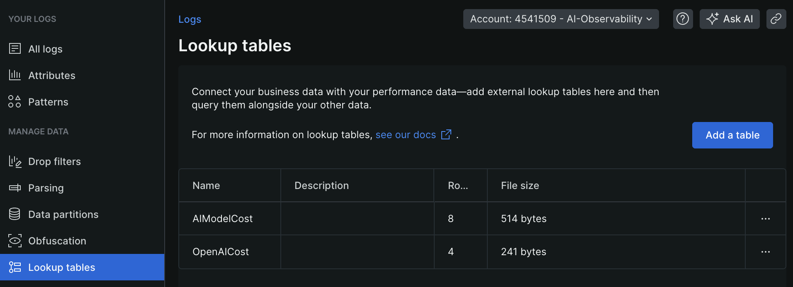
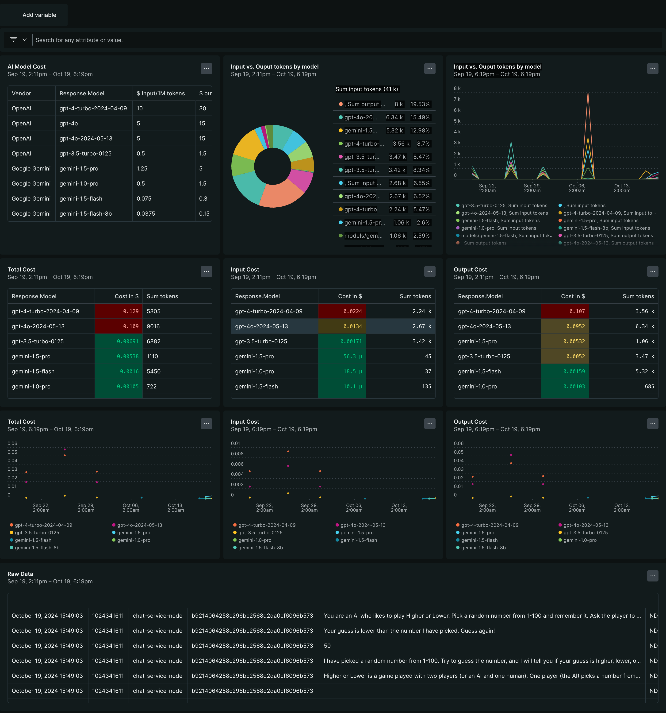

### **Summary**

Interested to explore programming and AI? You can explore the sample code and resources I used in my hands-on workshop by following the steps described below.

First, we'll provide an overview of basic programming concepts in Python and discuss how the internet works. Then, we'll dive into more advanced topics such as Large Language Models (LLM) and Prompt Engineering, which will teach you how to ask the right questions to OpenAI. Finally, we'll guide you through the process of building your own AI bot using all the concepts we've covered.

By the end of the workshop, you'll be able to interact with your AI bot, gain a better understanding of how things work, and start leveraging AI services to increase your productivity.

The tech stack used for this project includes HTML, CSS (with the Milligram framework), Python 3, Flask, and OpenAI. The project is used to support initiatives such as Women@NR and New Reluc Student Edition deployed in a virtual lab - Instruqt.

Presentation - [HERE](https://docs.google.com/presentation/d/1w8g8scW_mRSUYNHW6EsSvoS6Rmwk9WSQ_UzrmwDkCU0/edit?usp=sharing)

---

### Prerequisites

Here are some essential packages that need to be installed before you can start building your own AI bot using OpenAI and Python.

Firstly, you will need to download and install Python3 from the [official website](https://www.python.org/downloads/). This is an interpreted, high-level, and general-purpose programming language that is easy to learn and has a vast library of modules that enable you to accomplish a wide range of tasks.

Next, you will need to install Pip3, which is the package installer for Python. Pip3 is used to install, upgrade, and manage Python packages and their dependencies. To install Pip3, please visit the [official website](https://pip.pypa.io/en/stable/installation/) and follow the instructions provided.

It is essential too that you have [Python Flask](https://flask.palletsprojects.com/en/2.3.x/installation/) installed on your computer. Python Flask is a popular web framework used by developers to create web applications. It is a lightweight, flexible, and easy-to-use framework that can help you create web applications quickly and efficiently. Therefore, to get the most out of this workshop, we highly recommend that you take the time to install Python Flask.

Finally, you will need to install OpenAI, which is a powerful and flexible open-source library for building and training large-scale artificial intelligence models. OpenAI provides a simple and easy-to-use API that allows developers to access state-of-the-art AI models and technologies. You can install OpenAI by visiting the [official website](https://pypi.org/project/openai/) and following the installation instructions.

Optional - for better insight into your application's behavior, consider installing the [Python agent](https://docs.newrelic.com/install/python/) provided by New Relic. This agent is part of a powerful observability platform that can give you real-time visibility into your application. By detecting potential issues before they affect your users, you can optimize your application's performance and provide a better experience for your users.

---

### **Instructions**

Each level is designed to run as a standalone application to avoid unnecessary issues.

**Level One** will dive deeper by leveraging our previous experience with implementing OpenAI with functions and Flask. Specifically, we will take the function we previously created and make it available as an endpoint using Flask. By doing so, we will be able to expand the functionality of our application and make it more accessible to users.

To start the application, simply type the following commands:

```shell
export OPENAI_API_KEY=YOUR_API_KEY_HERE

flask --app levelone.py run --host 0.0.0.0 --port 5002
```

**Level Two** is an optional challenge that focuses on observability. This concept is important to ensure that the application runs smoothly and optimally for users. To achieve this, we will onboard a New Relic Python agent into our app. The agent collects data and provides real-time visibility into application behavior, helping to identify potential issues before they impact users.

To start the application, simply type the following commands:

```shell
export OPENAI_API_KEY=YOUR_API_KEY_HERE

NEW_RELIC_CONFIG_FILE=newrelic.ini newrelic-admin run-program flask --app leveltwo.py run --host 0.0.0.0 --port 5004
```

**Level Three** is an optional challenge that focuses on some fun image generation capabilities. This part of the OpenAI capabilities, i.e. leveraging dall-e-3 model, is not yet supported with New Relic AI Monitoring, but will soon be supported as well. The purpose of this exercise is purely to have some fun with image generation capabilities.

To start the application, simply type the following commands:

```shell
export OPENAI_API_KEY=YOUR_API_KEY_HERE

NEW_RELIC_CONFIG_FILE=newrelic.ini newrelic-admin run-program flask --app levelthree.py run --host 0.0.0.0 --port 5004
```

---

### **Cost Dashboard**

A nice feature of the New Relic platform is the capability to add lookup tables as part of the Logs section. In this case, I created a lookup table that includes the actual [OpenAI](https://openai.com/api/pricing/) and [Gemini](https://ai.google.dev/pricing) cost of running the different AI models. I created a [CSV file](./lookup-table-model-cost.csv) as part of the GitHub repository that you can use to import into your New Relic account as a [Lookup table](https://docs.newrelic.com/docs/nrql/using-nrql/lookups/).



This lookup table basically represents some static information that you then can use to reference for example in custom dashboards. I also provided an [example dashboard](./dashboard.json) that leverages that lookup table and joins it with the AI monitoring data that we collected. You can use the JSON representation of the dashboard and import it into your New Relic account as well.

**Note**: Please update all of the placeholders that reference NEW_RELIC_ACCOUNT_ID in JSON with your actual New Relic account ID.

Once you imported the dashboard, you can then look at a similar result as shown below. The dashboard takes the actual tokens used throughout your interaction with the chat service and multiplies it with the data from the OpenAI cost lookup table.


